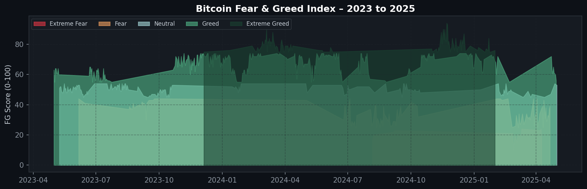
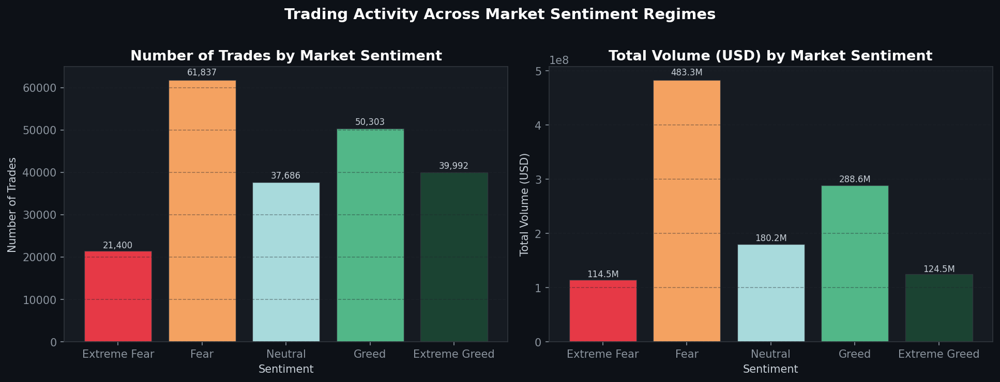
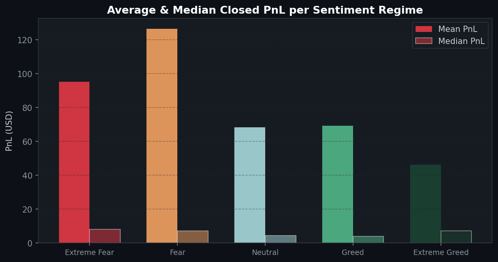
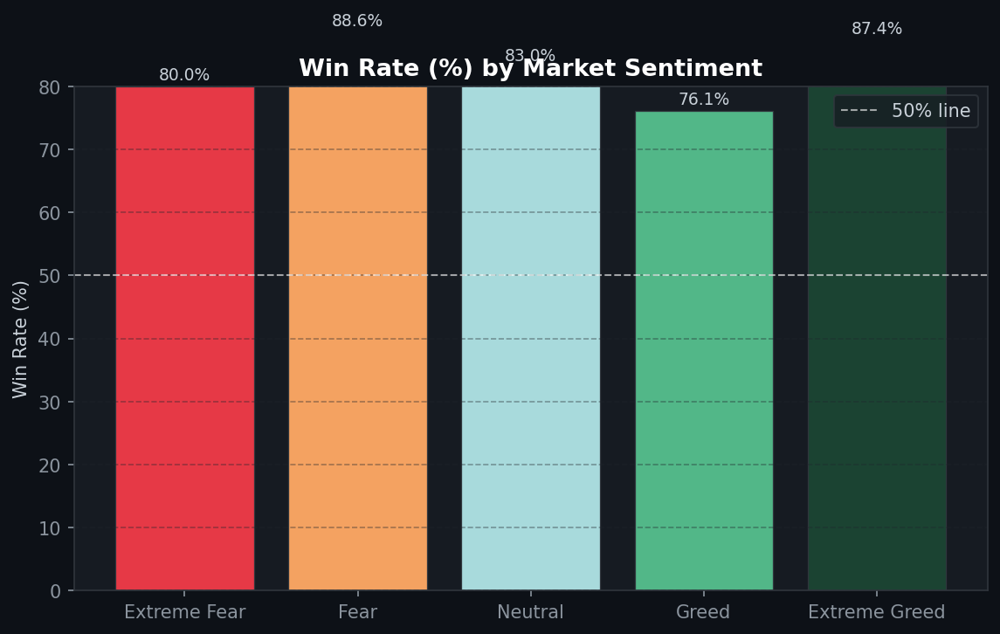
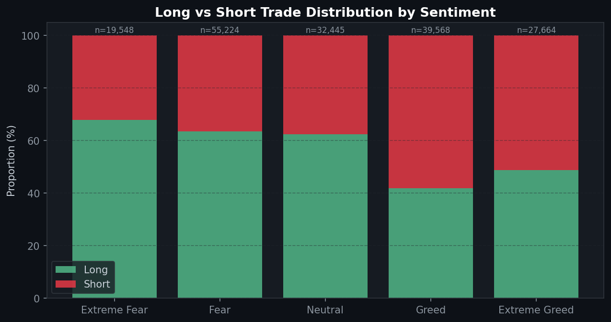
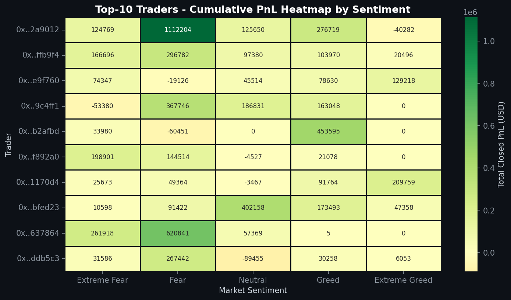
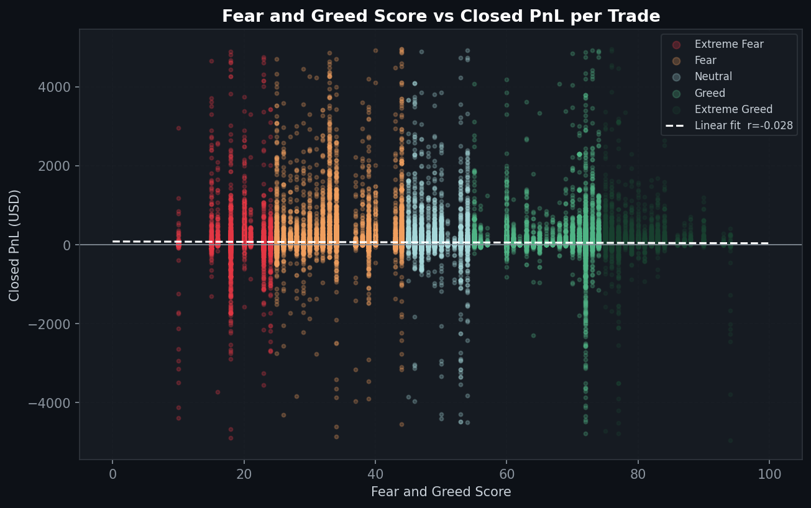
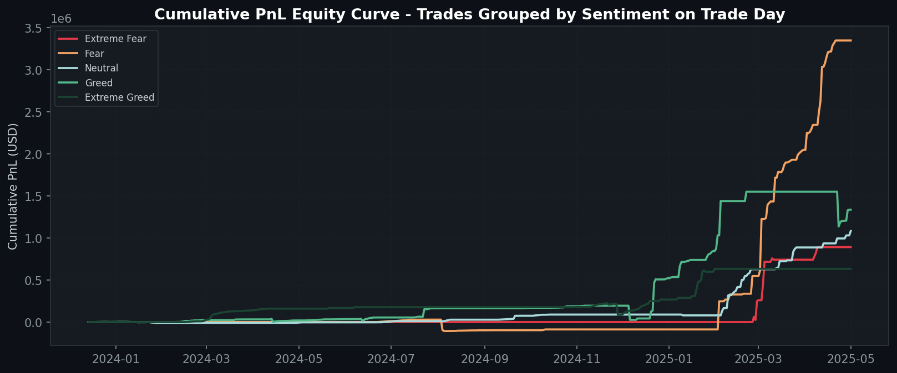

# 📊 Primetrade.ai Round-0 — AI Internship

> **Exploring Trader Performance × Bitcoin Market Sentiment on Hyperliquid**


---

## 🎯 Objective

Analyze **211,224 trades** from 32 Hyperliquid traders alongside the **Bitcoin Fear & Greed Index** to:

- Uncover how market sentiment affects trader performance
- Identify hidden patterns in win rates, PnL, and positioning
- Deliver actionable insights to drive smarter trading strategies

---

## 📁 Repository Structure

```
📦 primetrade-round0-analysis
 ┣ 📓 Primetrade_Round0_Analysis.ipynb   ← Main analysis notebook
 ┣ 📜 analysis.py                         ← Chart generation script
 ┣ 📜 generate_report.py                  ← HTML report generator
 ┣ 📄 summary_stats.csv                   ← Summary statistics
 ┣ 📁 charts/
 ┃  ┣ 🖼️ 01_sentiment_timeline.png
 ┃  ┣ 🖼️ 02_volume_by_sentiment.png
 ┃  ┣ 🖼️ 03_pnl_by_sentiment.png
 ┃  ┣ 🖼️ 04_winrate_by_sentiment.png
 ┃  ┣ 🖼️ 05_long_short_by_sentiment.png
 ┃  ┣ 🖼️ 06_trader_heatmap.png
 ┃  ┣ 🖼️ 07_fee_by_sentiment.png
 ┃  ┣ 🖼️ 08_monthly_pnl_heatmap.png
 ┃  ┣ 🖼️ 09_scatter_fg_pnl.png
 ┃  ┗ 🖼️ 10_equity_curves.png
 ┗ 📁 dataset/                            ← Input data (not tracked)
```

---

## 📊 Datasets

| Dataset                            |     Records      |   Period    |
| :--------------------------------- | :--------------: | :---------: |
| Bitcoin Fear & Greed Index         | 2,644 daily rows | 2018 – 2025 |
| Hyperliquid Historical Trader Data |  211,224 trades  | 2023 – 2025 |

---

## 🔍 Key Findings

| #   | Finding                                         | Data                                    |
| :-- | :---------------------------------------------- | :-------------------------------------- |
| 1   | **Fear regimes produce 2.7× higher avg PnL**    | Fear: $126.41 vs Extreme Greed: $46.23  |
| 2   | **Win rate peaks during Fear**                  | Fear: 88.6% — Greed: 76.1%              |
| 3   | **Volume surges during Fear, not Greed**        | 61.8K trades, $483M volume on Fear days |
| 4   | **Structural long bias across all sentiments**  | ~55–60% long positions everywhere       |
| 5   | **Fear generates 46% of total profits**         | $3.35M of $7.29M cumulative PnL         |
| 6   | **Sentiment = regime filter, not trade signal** | r ≈ 0 on individual trade correlation   |

---

## 💡 Strategy Recommendations

### 1. Sentiment-Weighted Position Sizing

| Regime        | FG Score |            Adjustment             |
| :------------ | :------: | :-------------------------------: |
| Extreme Fear  |  0 – 24  |             +20% size             |
| **Fear**      | 25 – 44  | **+30% size** ✅ Best risk/reward |
| Neutral       | 45 – 55  |              Normal               |
| **Greed**     | 56 – 74  | **−20% size** ⚠️ Lowest win rate  |
| Extreme Greed | 75 – 100 |              Normal               |

### 2. Contrarian Entry Filter

Prioritize **long entries during Fear** (FG < 25). Apply extra scrutiny to short entries during Greed.

### 3. Dynamic Risk Management

- **Wider stops in Fear** — higher win rate gives breathing room
- **Tighter stops in Greed** — lower win rate demands discipline

---

## 📈 Visualizations

<table>
  <tr>
    <td></td>
    <td></td>
  </tr>
  <tr>
    <td></td>
    <td></td>
  </tr>
  <tr>
    <td></td>
    <td></td>
  </tr>
  <tr>
    <td></td>
    <td></td>
  </tr>
</table>

---

## ▶️ How to Run

```bash
# Clone the repo
git clone https://github.com/1919-14/primetrade-round0-analysis.git
cd primetrade-round0-analysis

# Install dependencies
pip install pandas numpy matplotlib seaborn scipy jupyter

# Run chart generation
python analysis.py

# Open the notebook
jupyter notebook Primetrade_Round0_Analysis.ipynb
```

---

## 🧾 Conclusion

> **"Buy fear, reduce exposure in greed."**
>
> Market sentiment is a powerful **regime filter** — not a single-trade signal. Top Hyperliquid traders consistently lean into fear rather than retreating, and their profits reflect it. Integrating sentiment-weighted sizing and contrarian entry filters can meaningfully improve strategy performance.

---

**Author:** V S S K Sai Narayana  
**Role:** Data Scientist Intern — Primetrade.ai Round 0  
**Date:** May 2026
